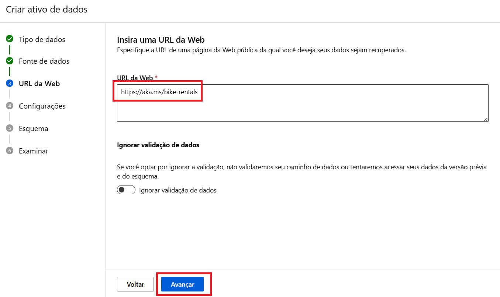

# AI-900: Trabalhando com Machine Learning na Prática no Azure ML
Utilização do serviço Aprendizado de Máquina do Azure para treinar e avaliar um modelo de aprendizado de máquina, seguido da implantação e teste do modelo treinado.

Neste exercício, foi utilizado um dataset público contendo o histórico de aluguel de bicicletas para treinar um modelo. Este modelo prevê o número de bicicletas necessárias em um determinado dia, com base em características sazonais e meteorológicas, para atender à demanda de locação.

# 1ª Etapa) Aprovisionar o serviço de Machine Learning

a) Acessar o Azure Machine Learning
  
[

b) Criar um Resource Group para armazenar o serviço
002

c) Inserir as configurações do Workspace
--> Informar apenas o campo Name
--> Para os demais, deixar os valores padrões
--> Na sequência, clicar em Review + create

d) Crear o serviço
--> Aguardar a mensagem de validação, conforme imagem a baixo, e clicar em Create

e) Aguardar a implantação do serviço
--> Quando a mesma estiver concluída, o status <i>Your deployment is complete</i> aparecerá na tela
--> Esta etapa leva alguns instantes para ser concluída

# 2ª Etapa) Configurar os modelos de Machine Learning e os conjuntos de dados

a) Abrir o Machine Learning Studio
--> Durante o carregamento, pode ser solicitado, novamente, sua conta do Azure

b) Criar um Novo Trabalho de Machine Learning Automatizado

c) Preencher as configurações básicas

d) Criar o tipo de tarefa

e) Criar o ativo de dados

f) Configurar tarefas

g) Configurar computação

h) Enviar o trabalho para treinamento 

--> Esta ação levará cerca de 15 minutos para ser finalizada

--> Este é o status que indica a conclusão do treinamento

# 3ª Etapa) Analisar e Testar do Modelo

a) Checar a integridade dos dados

b) Checar a conclusão de todas as tarefas

c) Identificar o melhor modelo do treinamento

d) Checar as métricas deste modelo

--> As métricas mais importantes são: predicted_true e residuals

--> predicted_true: O gráfico predicted_true compara os valores previstos com os valores verdadeiros.

--> residuals: O gráfico de resíduos mostra os resíduos (as diferenças entre os valores previstos e reais) como um histograma

e) Implantar e testar o modelo

--> A implantação leva entre 5 e 10 minutos

f) Testar o modelo

--> Resultado do teste
O resultado indica a quantidade de bicicletas necessárias para atender à demanda de acordo com a data e as condições meterorógicas informadas

