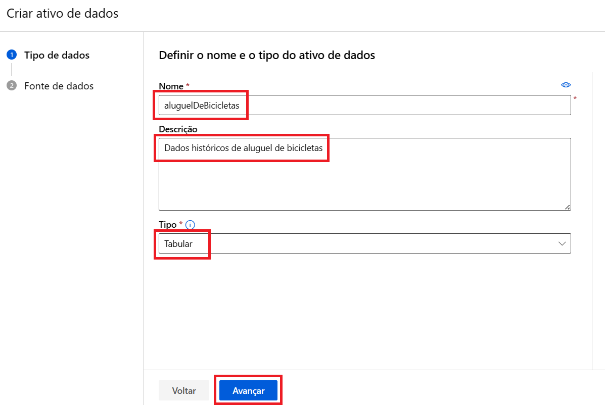
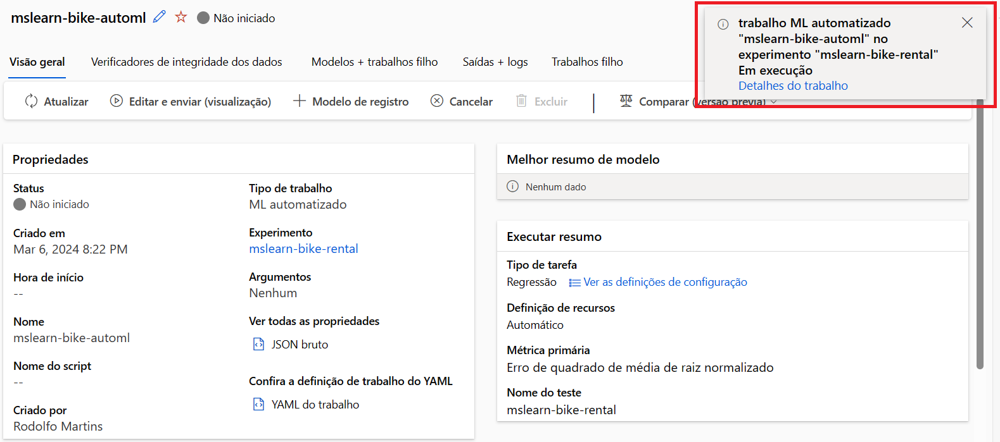
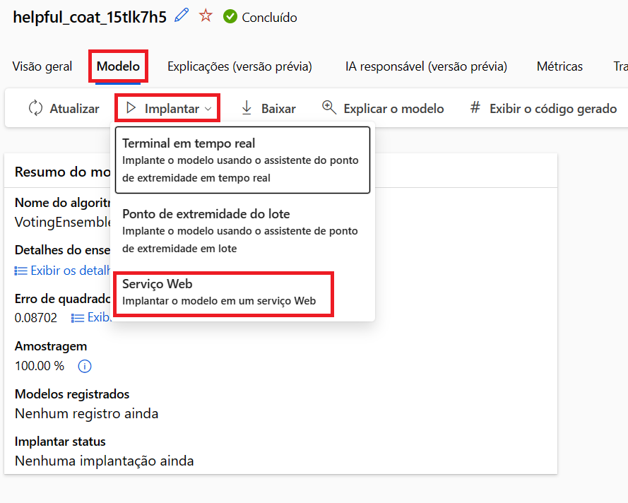

# AI-900: Trabalhando com Machine Learning na Prática no Azure ML

-green)

-blue)
-blue)

 

## Índice

- [Descrição do Projeto](#Descrição-do-Projeto)
- [Acessos necessários](#Acessos-necessários)
- [Introdução](#Introdução)
- [Aprovisionando o serviço de *Machine Learning*](#Aprovisionando-o-serviço-de-Machine-Learning)
- [Configurando os modelos de *Machine Learning* e os conjuntos de dados](#Configurando-os-modelos-de-Machine-Learning-e-os-conjuntos-de-dados)
- [Analisando e Testando o Modelo](#Analisando-e-Testando-o-Modelo)
- [Conclusão](#Conclusão)
- [Limpar o ambiente](#Limpar-o-ambiente)
- [Certificados / Certificações Associados ao Projeto](#Certificados-/-Certificações-Associados-ao-Projeto)

 

## Descrição do Projeto

Este projeto é um dos laboratórios do Bootcamp [Microsoft Azure AI Fundamentals](https://web.dio.me/track/microsoft-azure-ai-fundamentals), promovido através da parceria entre a Microsoft e a Dio.me.

Os alunos deste bootcamp tem, como principal objetivo, se prepararem para o exame de certificação Microsoft AI-900, dominando conceitos como visão computacional, classificação inteligente de imagem e inteligência de documentos com IA, enquanto se familiarizam com as tecnologias da Microsoft Azure.

Este desafio é o de número 1 do bootcamp e consiste na execução prática do seguinte exercício:

- [Aprendizagem de Máquina Automatizada](https://aka.ms/ai900-auto-ml): explorar a automatização de *machine learning* no ***Azure Auto ML***

 

## Acessos necessários

Para realizar estes laboratórios, eu precisei criar uma [Subscrição do Microsoft Azure](https://azure.microsoft.com/)

A Microsoft permite criar uma subscrição de teste, na qual vários serviços podem ser experimentados gratuitamente por 12 meses, além de receber $200 para serem utilizados nos primeiros 30 dias.

 

## Introdução

O aprendizado de máquina automatizado permite experimentar vários algoritmos e parâmetros para treinar modelos e identificar o melhor para seus dados, seguido da implantação e teste do mesmo.

Neste exercício, utilizei um dataset público contendo o histórico de aluguel de bicicletas para treinar um modelo.

Este modelo previu o número de bicicletas necessárias para atender à demanda de locação em um determinado dia, com base em características sazonais e meteorológicas.

 

## Aprovisionando o serviço de *Machine Learning*

1) Como primeiro passo, acessei o **Azure Machine Learning**:

   > 

2) Criei um ***Resource Group*** para armazenar o serviço:

   > 

3) Inserir as configurações do Workspace (preenchi apenas o campo ***Name***. Para os demais, deixar os valores padrões):

   > 

4) Criei o serviço:

   > É necessário aguardar a mensagem de validação, conforme imagem a baixo, e, depois, clicar em ***Create***
  
   > 

5) Aguardei a implantação do serviço:

   > 

 

## Configurando os modelos de *Machine Learning* e os conjuntos de dados

1) Abri o **Machine Learning Studio**:

   > **Atenção:** Durante o carregamento, pode ser solicitado, novamente, sua conta do Azure

   > 

2) Criar um Novo Trabalho de Machine Learning Automatizado

   > 

3) Preenchi as configurações básicas:

   > 

4) Criei o tipo de tarefa:

   > 

5) Criei o ativo de dados:
   > ***Tipo de dados***
   >
   > 

   > ***Fonte de dados***
   >
   > 

   > ***URL da Web***
   >
   > 

   > ***Configurações***
   >
   > 

   > ***Esquema***
   >
   > 

   > ***Examinar***
   >
   > 

6) Criei o tipo de dados:
   >
   > 

7) Configurei as tarefas:

   > 

   > 

   > 

   > 

8) Configurei a computação:

   > 

9) Enviei o trabalho para treinamento:
   > **Atenção**: Esta ação levou cerca de 15 minutos para ser finalizada
   
   > 
   
   > 
   
   > 

 

## Analisando e Testando o Modelo

1) Chequei a integridade dos dados:

   > 

2) Chequei a conclusão de todas as tarefas:

   > 

3) Identifiquei o melhor modelo do treinamento:

   > 

4) Chequei as métricas do modelo escolhido:

   > 

   As métricas mais importantes são: **predicted_true** e **residuals***

     > 

   *- **predicted_true**: O gráfico predicted_true compara os valores previstos com os valores verdadeiros.*

     > 

   *- **residuals:** O gráfico de resíduos mostra os resíduos (as diferenças entre os valores previstos e reais) como um histograma*

     > 

6) Implantei e testei o modelo

   > 

   > 

   > **Atenção**: A implantação levou entre 5 e 10 minutos*

   > 

7) Testei o modelo

   > 

   O resultado do teste indicou que precisava de 298 bicicletas para atender à demanda de acordo com a data e as condições meterorógicas informadas

   > 

 

## Conclusão

Este exercício demonstrou o poder e a eficácia do aprendizado de máquina automatizado.

Ao utilizar um conjunto de dados históricos de aluguel de bicicletas, fui capaz de treinar um modelo para prever com precisão o número de aluguéis esperados em um determinado dia, levando em consideração fatores sazonais e meteorológicos.

Isso ilustra como o aprendizado de máquina pode ser aplicado a problemas do mundo real, fornecendo insights valiosos e permitindo a tomada de decisões informadas.

A capacidade de experimentar vários algoritmos e parâmetros me permitiu identificar o modelo mais eficaz para os dados específicos.

Este é apenas um exemplo do potencial do aprendizado de máquina automatizado e das possibilidades que ele oferece para uma ampla gama de aplicações.

 

## Limpando o ambiente

> [!WARNING]
> Após a conclusão do projeto, se não for reaproveitar os recursos utilizados, é aconselhável excluí-los, bem como os grupos de recursos, para que não haja cobranças indevidas na sua Azure Subscription

 

## Certificados / Certificações Associados ao Projeto

